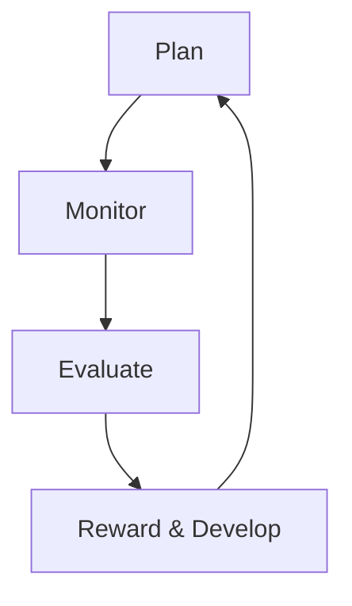

# IPCR (Individual Performance Commitment Review) – Quick Guide

## 🎯 What is IPCR?

**IPCR** stands for **Individual Performance Commitment Review**. It’s a structured way to plan, track, and evaluate your work performance over a set period (usually a semester or year). Think of it as your personal "work GPS" – you set destinations (goals), check your route (progress), and celebrate milestones (achievements).

### 📌 Key Concepts

- **OPCR**: Office Performance Commitment Review (team/organization goals)
- **IPCR**: Individual Performance Commitment Review (your personal goals)
- **SPMS**: Strategic Performance Management System (the overall framework)

### 🔄 The IPCR Cycle

## 📝 Step-by-Step Guide

### 1️⃣ Plan Your IPCR

**What to do:**
- Fill out the **Scale Individual Activity Plan** form
- Set clear, measurable goals aligned with your role and organizational objectives
- Identify resources, timeline, and potential risks

**Pro Tip:**
- Break big goals into smaller, manageable tasks
- Use the SMART framework (Specific, Measurable, Achievable, Relevant, Time-bound)

### 2️⃣ Monitor Your Progress

**What to do:**
- Regularly check your progress against your plan
- Keep a journal or log of your activities and achievements
- Communicate with your supervisor for feedback and support

**Pro Tip:**
- Use a simple spreadsheet or app to track your progress
- Celebrate small wins to stay motivated

### 3️⃣ Evaluate Your Performance

**What to do:**
- Fill out the **Scale Individual Program Report** form
- Gather evidence of your achievements (reports, photos, certifications, etc.)
- Rate your performance using the five-point scale

**Pro Tip:**
- Be honest and objective in your self-assessment
- Highlight both successes and areas for improvement

### 4️⃣ Reward & Develop

**What to do:**
- Receive feedback from your supervisor
- Identify areas for growth and development
- Plan for the next cycle

**Pro Tip:**
- Use feedback to set new goals and improve your skills
- Celebrate your achievements and reward yourself

## 📊 Performance Rating Scale

| Rating | Description | Adjectival Rating |
|--------|-------------|-------------------|
| 5 | Outstanding | Exceptional performance, exceeds expectations |
| 4 | Very Satisfactory | Exceeds expectations, high-quality work |
| 3 | Satisfactory | Meets expectations, good performance |
| 2 | Unsatisfactory | Below expectations, needs improvement |
| 1 | Poor | Significantly below expectations, major improvement needed |

**Pro Tip:**
- Aim for "Very Satisfactory" or "Outstanding" ratings
- Use feedback to improve and grow

## 🎯 Tips for a Low-Stress, Efficient, and Fun IPCR Experience

### 🌱 Start Early
- Don’t wait until the last minute to plan and track your goals
- Break tasks into smaller, manageable chunks

### 📅 Set Reminders
- Use calendar alerts or apps to remind you of deadlines and check-ins
- Schedule regular progress reviews with your supervisor

### 🎉 Celebrate Small Wins
- Acknowledge and celebrate your achievements, no matter how small
- Reward yourself for reaching milestones

### 🤝 Seek Support
- Don’t hesitate to ask for help or clarification
- Collaborate with colleagues and share best practices

### 📚 Learn and Grow
- Use feedback to identify areas for improvement
- Take advantage of training and development opportunities

### 🎨 Make It Fun
- Use colorful charts, stickers, or apps to track your progress
- Gamify your goals with rewards and challenges

## 📚 Resources

- **Scale Individual Activity Plan**: `manuals/STUDENT AFFAIRS MANUAL (SAM) Ver2/Forms/PSHS-00-F-DSA-13-Ver02-Rev0 Scale Individual Activity Plan.pdf`
- **Scale Individual Program Report**: `manuals/STUDENT AFFAIRS MANUAL (SAM) Ver2/Forms/PSHS-00-F-DSA-14-Ver02-Rev0 Scale Individual Program Report.pdf`
- **Strategic Performance Management System**: `manuals/FINANCE AND ADMINISTRATION MANUAL (FAM) Ver2/Manuals/PSHSS FAM 4.5 Strategic Performance Management System V2_Rev0.pdf`
- **Performance Evaluation**: `manuals/QUALITY MANUAL (QM) Ver2/Manuals/PSHSS QM 9.0 Performance Evaluation V2_Rev2.pdf`

## 🎯 Summary

IPCR is your personal work GPS – plan your route, track your progress, and celebrate your achievements. By starting early, setting reminders, celebrating small wins, seeking support, learning and growing, and making it fun, you can have a low-stress, efficient, and enjoyable IPCR experience. 🚀