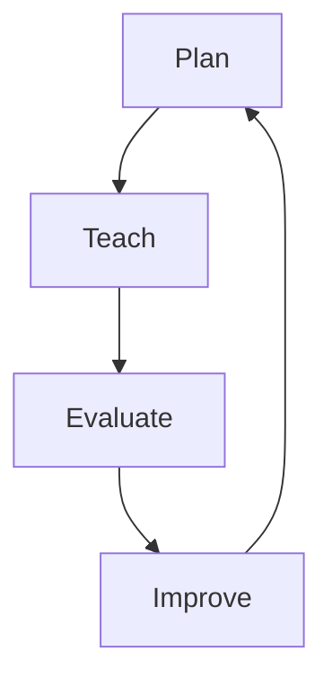

# Teaching Performance Evaluation – Quick Guide

## 🎯 What is Teaching Performance Evaluation?

**Teaching Performance Evaluation** is a structured way to assess and improve the quality of teaching in the Philippine Science High School system. It involves feedback from both students and superiors to provide a well-rounded view of a teacher's performance.

### 📌 Key Concepts

- **Student Evaluation**: Feedback from students on teaching effectiveness
- **Superior Evaluation**: Feedback from superiors on teaching performance
- **Performance Rating**: Overall rating based on feedback and observations

### 🔄 The Teaching Performance Evaluation Cycle

## 📝 Step-by-Step Guide

### 1️⃣ Plan Your Teaching

**What to do:**
- Set clear learning objectives for your students
- Plan engaging and interactive lessons
- Identify resources and materials needed

**Pro Tip:**
- Use the SMART framework for setting objectives
- Incorporate a variety of teaching methods to cater to different learning styles

### 2️⃣ Teach Your Students

**What to do:**
- Deliver your lessons with enthusiasm and clarity
- Engage students with questions, discussions, and activities
- Provide feedback and support to help students succeed

**Pro Tip:**
- Use technology and multimedia to enhance your lessons
- Encourage student participation and collaboration

### 3️⃣ Evaluate Your Performance

**What to do:**
- Gather feedback from students using the **Teaching Performance Evaluation Tool by Students**
- Receive feedback from superiors using the **Teaching Performance Evaluation Tool by Superior**
- Reflect on your performance and identify areas for improvement

**Pro Tip:**
- Be open to feedback and use it to grow
- Celebrate your strengths and work on your weaknesses

### 4️⃣ Improve Your Teaching

**What to do:**
- Use feedback to set new goals and improve your teaching
- Take advantage of training and development opportunities
- Collaborate with colleagues to share best practices

**Pro Tip:**
- Continuously seek ways to improve your teaching
- Stay updated with the latest teaching methods and technologies

## 📊 Performance Rating Scale

| Rating | Description | Adjectival Rating |
|--------|-------------|-------------------|
| 5 | Outstanding | Exceptional teaching, exceeds expectations |
| 4 | Very Satisfactory | Exceeds expectations, high-quality teaching |
| 3 | Satisfactory | Meets expectations, good teaching |
| 2 | Unsatisfactory | Below expectations, needs improvement |
| 1 | Poor | Significantly below expectations, major improvement needed |

**Pro Tip:**
- Aim for "Very Satisfactory" or "Outstanding" ratings
- Use feedback to improve and grow

## 🎯 Tips for a Low-Stress, Efficient, and Fun Teaching Performance Evaluation Experience

### 🌱 Start Early
- Don’t wait until the last minute to plan and track your goals
- Break tasks into smaller, manageable chunks

### 📅 Set Reminders
- Use calendar alerts or apps to remind you of deadlines and check-ins
- Schedule regular progress reviews with your supervisor

### 🎉 Celebrate Small Wins
- Acknowledge and celebrate your achievements, no matter how small
- Reward yourself for reaching milestones

### 🤝 Seek Support
- Don’t hesitate to ask for help or clarification
- Collaborate with colleagues and share best practices

### 📚 Learn and Grow
- Use feedback to identify areas for improvement
- Take advantage of training and development opportunities

### 🎨 Make It Fun
- Use colorful charts, stickers, or apps to track your progress
- Gamify your goals with rewards and challenges

## 📚 Resources

- **Teaching Performance Evaluation Tool by Students**: `manuals/CURRICULUM AND INSTRUCTION MANUAL (CIM) Ver2/Forms/PSHS-00-F-CID-17-Ver02-Rev1 Teaching Performance Evaluation Tool by Students.pdf`
- **Teaching Performance Evaluation Tool by Superior**: `manuals/CURRICULUM AND INSTRUCTION MANUAL (CIM) Ver2/Forms/PSHS-00-F-CID-18-Ver02-Rev0 Teaching Performance Evaluation Tool by Superior.pdf`

## 🎯 Summary

Teaching Performance Evaluation is a structured way to assess and improve the quality of teaching. By starting early, setting reminders, celebrating small wins, seeking support, learning and growing, and making it fun, you can have a low-stress, efficient, and enjoyable teaching performance evaluation experience. 🚀