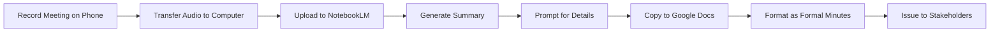

# Plan: NLM-1 — AI-Powered Meeting Minutes with NotebookLM

## Background & Rationale

Office secretaries at PSHS-MC currently spend significant time manually transcribing and writing meeting minutes from audio recordings. Google's **NotebookLM** is a free AI tool that can ingest audio files and generate summaries, key topics, and structured notes — dramatically reducing the turnaround time for issuing meeting minutes.

This training follows the same format as [`LO-1`](trainings/LO-1_README.md) — a supplemental session recommended for **all PSHS-MC staff**, but especially critical for **office secretaries** who are responsible for documenting meetings.

---

## Proposed Session Information

| Field | Value |
|-------|-------|
| **Session ID** | NLM-1 |
| **Session Title** | AI-Powered Meeting Minutes with NotebookLM |
| **Duration** | 1 hour - 60 minutes |
| **Prerequisites** | Session 0 - Google Workspace Fundamentals |
| **Primary Tool** | Google NotebookLM - notebooklm.google.com |
| **Supporting Tools** | Phone voice recorder app, Google Docs |
| **Manual Reference** | N/A - General productivity best practice |
| **Target Audience** | All PSHS-MC staff - especially office secretaries |

---

## Learning Objectives

By the end of this session, participants will be able to:

1. Understand what NotebookLM is and why it is useful for meeting minutes
2. Record clear meeting audio using a smartphone voice recorder
3. Upload audio recordings to NotebookLM as a source
4. Generate a meeting summary using NotebookLM's built-in tools
5. Use targeted prompts to extract action items, decisions, and discussion points
6. Refine NotebookLM output into a formal PSHS meeting minutes document in Google Docs
7. Apply best practices for audio quality and privacy when recording meetings

---

## Time Allocation - 60 minutes

| Component | Time | Notes |
|-----------|------|-------|
| **Pre-Session Video** - async | 10-15 min | Sent 2-3 days before session |
| **In-Person Session** | 60 min | |
| -- Welcome and Q&A on Video | 5 min | Address questions from pre-session video |
| -- What is NotebookLM and Why Use It | 5 min | Demo of a finished output |
| -- Recording Meeting Audio on Your Phone | 8 min | Best practices for clear audio |
| -- Uploading Audio to NotebookLM | 8 min | Creating a notebook, adding audio source |
| -- Generating Summaries and Notes | 10 min | Using NotebookLM features: Summary, Key Topics, Audio Overview |
| -- Prompting for Meeting Minutes | 10 min | Extracting action items, decisions, discussion points |
| -- Refining Output into Google Docs | 6 min | Copy-paste, formatting, formal minutes template |
| -- Audience Practice | 5 min | Guided exercise with sample audio |
| -- Wrap-up and Tips | 3 min | Privacy, limitations, best practices |

---

## Training Workflow

---

## Files to Create - 6 files following existing convention

### 1. `NLM-1_README.md`
- Overview, session info table, file descriptions
- Why NotebookLM section
- Privacy and data considerations

### 2. `NLM-1_trainer-guide.md`
- Full trainer script with all sections:
  - Session metadata and learning objectives
  - Time allocation breakdown
  - Opening Q&A with anticipated questions
  - Introduction to NotebookLM
  - Recording meeting audio on phone - best practices
  - Uploading audio to NotebookLM
  - Generating summaries and extracting notes
  - Prompting techniques for meeting minutes
  - Refining output into formal Google Docs minutes
  - Audience Practice: guided exercise with sample audio
  - Contest Activity: independent challenge
  - Answer key and scoring rubric
  - Troubleshooting tips
  - Privacy and ethical considerations
  - Pre-training setup recommendations

### 3. `NLM-1_video-script.md`
- 10-15 minute pre-session video script:
  - Opening analogy: stenographer vs AI assistant
  - Keywords: NotebookLM, audio source, AI summary, prompt, action items
  - Pattern demonstration: full workflow from recording to formatted minutes
  - Quick check question
  - Production notes

### 4. `NLM-1_exercise.md`
- Hands-on exercise with:
  - Exercise scenario: you recorded a staff meeting on your phone
  - Step-by-step tasks:
    - Part 1: Upload the sample audio to NotebookLM
    - Part 2: Generate a summary and review key topics
    - Part 3: Use prompts to extract action items and decisions
    - Part 4: Create formal meeting minutes in Google Docs
  - Self-check answers
  - Challenge variations
  - Troubleshooting guide

### 5. `NLM-1_quick-ref-card.md`
- Side A: Step-by-step guides
  - How to record meeting audio on your phone
  - How to upload audio to NotebookLM
  - How to generate a meeting summary
  - How to prompt for action items and decisions
  - How to format minutes in Google Docs
- Side B: Reference material
  - Sample prompt library for meeting minutes
  - Audio recording best practices
  - PSHS meeting minutes format template
  - Privacy reminders
  - Common mistakes and solutions
  - NotebookLM limitations

### 6. `NLM-1_template.csv`
- Meeting minutes template with columns:
  - Meeting Title, Date, Time, Location, Chairperson, Attendees
  - Agenda Item, Discussion Summary, Decision, Action Item, Responsible Person, Deadline
  - Pre-populated with example rows and empty rows for data entry

---

## Key Design Decisions

### Why NotebookLM and not other AI tools?
- **Free** — part of Google ecosystem, aligns with PSHS Google Workspace
- **No data training** — NotebookLM does not use your data to train AI models
- **Audio-native** — designed to handle audio sources directly
- **Citable** — responses include citations back to the source audio
- **Simple** — no complex prompt engineering required for basic use

### Privacy Considerations to Address
- Only record meetings where you have authorization
- Inform participants that the meeting is being recorded
- NotebookLM data stays within the Google account — not shared
- Delete audio sources from NotebookLM after minutes are finalized
- Do not upload confidential HR or legal proceedings without clearance

### Target Audience Emphasis
While open to all staff, the training materials will include specific callouts for **office secretaries** as the primary beneficiaries, with examples tailored to common PSHS meeting types:
- Administrative meetings
- Committee meetings
- Staff meetings
- Management committee meetings

---

## Dependencies and Prerequisites

- Participants need a **Google account** — already covered by Session 0
- Participants need a **smartphone** with a voice recorder app
- **Sample audio file** must be prepared for the exercise — a 3-5 minute mock meeting recording
- Trainer needs to pre-create a **NotebookLM notebook** for demonstration
- Internet access required during the session
