# PSHS-MC Google Workspace Training Catalog

**Philippine Science High School — Main Campus**
**Training Offerings for Administrative Units**
*Last Updated: April 2025*

---

## How to Use This Catalog

- **Materials Status** indicates whether training materials have been created
  - ✅ **Ready** — All 6 files created (README, trainer guide, video script, exercise, quick-ref card, template)
  - 🔲 **Planned** — Designed in curriculum but materials not yet created
- **Sequence** shows prerequisite chains — sessions must be taken in order
- **Target Audience** shows who should attend each session
- For logistics planning, use the companion CSV file `trainings/CATALOG.csv`

---

## Training Flow Diagram

```mermaid
flowchart TD
  S0[Session-0: Google Workspace Fundamentals<br/>ALL STAFF - Mandatory<br/>90 min]
  S0 --> LO1[LO-1: LibreOffice as Offline Backup<br/>ALL STAFF - Recommended<br/>60 min]
  S0 --> NLM1[NLM-1: AI-Powered Meeting Minutes<br/>ALL STAFF - Especially Secretaries<br/>60 min]
  
  S0 --> HSU1[HSU-1: Digital Health Records<br/>HSU<br/>75 min]
  S0 --> HSU3[HSU-3: Disease Monitoring<br/>HSU<br/>45 min]
  HSU1 --> HSU2[HSU-2: Health Screening<br/>HSU<br/>60 min]
  
  S0 --> LIB1[LIB-1: Library Inventory<br/>LIB<br/>90 min]
  LIB1 --> LIB2[LIB-2: Library Promotion<br/>LIB<br/>60 min]
  
  S0 --> REG1[REG-1: Digital Enrollment<br/>REG<br/>90 min]
  REG1 --> REG2[REG-2: Attendance and NCE<br/>REG<br/>60 min]
  
  S0 --> RHU1[RHU-1: Residence Hall Admin<br/>RHU<br/>75 min]
  
  S0 --> GSU1[GSU-1: Service Requests<br/>GSU<br/>90 min]
  GSU1 --> GSU2[GSU-2: Facility Use and Eval<br/>GSU<br/>60 min]
  
  S0 --> HRU1[HRU-1: Recruitment Tracking<br/>HRU<br/>90 min]
  S0 --> HRU3[HRU-3: Attendance and Perf<br/>HRU<br/>60 min]
  HRU1 --> HRU2[HRU-2: Training Mgmt<br/>HRU<br/>90 min]
  
  S0 --> ITU1[ITU-1: IT Service Mgmt<br/>ITU<br/>90 min]
  ITU1 --> ITU2[ITU-2: Backup and Security<br/>ITU<br/>60 min]
  
  S0 --> PRU1[PRU-1: Procurement Tracking<br/>PRU<br/>90 min]
  PRU1 --> PRU2[PRU-2: Provider Evaluation<br/>PRU<br/>60 min]
  
  S0 --> ACU1[ACU-1: Financial Tracking<br/>ACU<br/>90 min]
  ACU1 --> ACU2[ACU-2: Payment Processing<br/>ACU<br/>60 min]
  
  S0 --> RMU1[RMU-1: Digital Records<br/>RMU<br/>90 min]
  RMU1 --> RMU2[RMU-2: Records Disposition<br/>RMU<br/>60 min]
  
  style S0 fill:#1a73e8,stroke:#1a73e8,color:#fff
  style LO1 fill:#34a853,stroke:#34a853,color:#fff
  style NLM1 fill:#34a853,stroke:#34a853,color:#fff

```

---

## A. Foundational Training — Required for ALL Staff

| # | Session ID | Title | Duration | Prerequisites | Target Audience | Materials |
|---|-----------|-------|----------|---------------|----------------|-----------|
| 1 | Session-0 | Google Workspace Fundamentals | 1h 30m | Basic computer literacy | **All PSHS-MC staff** — mandatory for all units | ✅ Ready |

**Description:** Navigating the Google Workspace ecosystem (Gmail, Drive, Calendar, Docs, Sheets, Slides, Forms, Meet, Chat). PSHS email policies per FAM 12.2. Google Drive folder structure, sharing, and organization. Gmail essentials. Google Calendar basics. Google Chat vs Gmail. LibreOffice overview.

---

## B. Supplemental Sessions — Recommended for ALL Staff

These sessions are open to all staff but have particular relevance for specific roles.

| # | Session ID | Title | Duration | Prerequisites | Target Audience | Materials |
|---|-----------|-------|----------|---------------|----------------|-----------|
| 2 | LO-1 | LibreOffice as Offline Backup | 1h 00m | Session-0 | **All PSHS-MC staff** — recommended for all units | ✅ Ready |
| 3 | NLM-1 | AI-Powered Meeting Minutes with NotebookLM | 1h 00m | Session-0 | **All PSHS-MC staff** — especially office secretaries | ✅ Ready |

**LO-1 Description:** Installing and using LibreOffice (Writer, Calc, Impress) as a free offline backup when internet is unavailable or Google Workspace is down. Working offline and uploading when online.

**NLM-1 Description:** Using Google NotebookLM to transform phone audio recordings of meetings into structured meeting minutes. Covers recording best practices, uploading audio, generating summaries, prompting for action items and decisions, and formatting formal minutes in Google Docs.

---

## C. Unit-Specific Training Sessions

### C1. Health Services Unit — HSU

| # | Session ID | Title | Duration | Prerequisites | Target Audience | Materials |
|---|-----------|-------|----------|---------------|----------------|-----------|
| 4 | HSU-1 | Digital Health Records and Patient Tracking | 1h 15m | Session-0 | HSU staff, School Nurse, Physician | 🔲 Planned |
| 5 | HSU-2 | Health Screening Workflow Automation | 1h 00m | Session-0, HSU-1 | HSU staff, School Nurse, Physician | 🔲 Planned |
| 6 | HSU-3 | Infectious Disease Monitoring and Health Campaigns | 0h 45m | Session-0 | HSU staff, School Nurse, Physician | ✅ Ready |

**Sequence:** HSU-1 → HSU-2 (HSU-3 is independent)

---

### C2. Library Unit — LIB

| # | Session ID | Title | Duration | Prerequisites | Target Audience | Materials |
|---|-----------|-------|----------|---------------|----------------|-----------|
| 7 | LIB-1 | Library Inventory and Circulation Management | 1h 30m | Session-0 | LIB staff, Librarian, Library Assistants | 🔲 Planned |
| 8 | LIB-2 | Digital Library Promotion and Resource Management | 1h 00m | Session-0, LIB-1 | LIB staff, Librarian, Library Assistants | 🔲 Planned |

**Sequence:** LIB-1 → LIB-2

---

### C3. Registration Unit — REG

| # | Session ID | Title | Duration | Prerequisites | Target Audience | Materials |
|---|-----------|-------|----------|---------------|----------------|-----------|
| 9 | REG-1 | Digital Enrollment and Student Records Management | 1h 30m | Session-0 | REG staff, Registrar, Registration Clerks | 🔲 Planned |
| 10 | REG-2 | Attendance Tracking and NCE Campaign Management | 1h 00m | Session-0, REG-1 | REG staff, Registrar, Registration Clerks | 🔲 Planned |

**Sequence:** REG-1 → REG-2

---

### C4. Residence Hall Unit — RHU

| # | Session ID | Title | Duration | Prerequisites | Target Audience | Materials |
|---|-----------|-------|----------|---------------|----------------|-----------|
| 11 | RHU-1 | Residence Hall Administration and Monitoring | 1h 15m | Session-0 | RHU staff, Residence Hall Head, Residence Hall Attendants | ✅ Ready |

---

### C5. General Services Unit — GSU

| # | Session ID | Title | Duration | Prerequisites | Target Audience | Materials |
|---|-----------|-------|----------|---------------|----------------|-----------|
| 12 | GSU-1 | Service Request and Maintenance Tracking | 1h 30m | Session-0 | GSU staff, Property Custodian | 🔲 Planned |
| 13 | GSU-2 | Facility Use Management and Performance Evaluation | 1h 00m | Session-0, GSU-1 | GSU staff, Property Custodian, Security Head, Janitorial Services Head | ✅ Ready |

**Sequence:** GSU-1 → GSU-2

---

### C6. Human Resources Unit — HRU

| # | Session ID | Title | Duration | Prerequisites | Target Audience | Materials |
|---|-----------|-------|----------|---------------|----------------|-----------|
| 14 | HRU-1 | Recruitment and Applicant Tracking | 1h 30m | Session-0 | HRU staff, HRMO | 🔲 Planned |
| 15 | HRU-2 | Training Management and Employee Records | 1h 30m | Session-0, HRU-1 | HRU staff, HRMO | 🔲 Planned |
| 16 | HRU-3 | Attendance Tracking and Performance Management | 1h 00m | Session-0 | HRU staff, HRMO | 🔲 Planned |

**Sequence:** HRU-1 → HRU-2 (HRU-3 is independent)

---

### C7. Information Technology Unit — ITU

| # | Session ID | Title | Duration | Prerequisites | Target Audience | Materials |
|---|-----------|-------|----------|---------------|----------------|-----------|
| 17 | ITU-1 | IT Service Management and Google Workspace Administration | 1h 30m | Session-0 | ITU staff, ISA, IT Personnel | 🔲 Planned |
| 18 | ITU-2 | Backup, Recovery, and Security Practices | 1h 00m | Session-0, ITU-1 | ITU staff, ISA, IT Personnel | 🔲 Planned |

**Sequence:** ITU-1 → ITU-2

---

### C8. Procurement Unit — PRU

| # | Session ID | Title | Duration | Prerequisites | Target Audience | Materials |
|---|-----------|-------|----------|---------------|----------------|-----------|
| 19 | PRU-1 | Procurement Tracking and Quotation Management | 1h 30m | Session-0 | PRU staff, BAC Members | 🔲 Planned |
| 20 | PRU-2 | External Provider Evaluation and Document Management | 1h 00m | Session-0, PRU-1 | PRU staff, BAC Members | 🔲 Planned |

**Sequence:** PRU-1 → PRU-2

---

### C9. Accounting Unit — ACU

| # | Session ID | Title | Duration | Prerequisites | Target Audience | Materials |
|---|-----------|-------|----------|---------------|----------------|-----------|
| 21 | ACU-1 | Financial Tracking and Reporting with Google Sheets | 1h 30m | Session-0, intermediate sheets skills | ACU staff, Accountant, Budget Officer | 🔲 Planned |
| 22 | ACU-2 | Payment Processing and Collection Management | 1h 00m | Session-0, ACU-1 | ACU staff, Accountant, Cashier | 🔲 Planned |

**Sequence:** ACU-1 → ACU-2

---

### C10. Records Management Unit — RMU

| # | Session ID | Title | Duration | Prerequisites | Target Audience | Materials |
|---|-----------|-------|----------|---------------|----------------|-----------|
| 23 | RMU-1 | Digital Records Tracking and Mail Management | 1h 30m | Session-0 | RMU staff, Records Officer, Receiving Clerks | ✅ Ready |
| 24 | RMU-2 | Records Inventory, Disposition, and Electronic Records | 1h 00m | Session-0, RMU-1 | RMU staff, Records Officer, Receiving Clerks | 🔲 Planned |

**Sequence:** RMU-1 → RMU-2

---

## Summary Statistics

| Metric | Count |
|--------|-------|
| **Total Sessions** | 24 |
| **Total Training Hours** | ~27.5 hours |
| **Materials Ready** | 8 sessions |
| **Materials Planned** | 16 sessions |
| **Units Covered** | 10 units + all-staff sessions |

---

## Materials Status Summary

| Status | Sessions |
|--------|----------|
| ✅ **Ready** | Session-0, LO-1, NLM-1, HSU-3, RHU-1, GSU-2, RMU-1 |
| 🔲 **Planned** | HSU-1, HSU-2, LIB-1, LIB-2, REG-1, REG-2, GSU-1, HRU-1, HRU-2, HRU-3, ITU-1, ITU-2, PRU-1, PRU-2, ACU-1, ACU-2, RMU-2 |

---

## Recommended Implementation Phases

| Phase | Sessions | Focus |
|-------|----------|-------|
| **Phase 1 — Foundation** | Session-0, LO-1, NLM-1 | All staff — baseline competency |
| **Phase 2 — High-Impact Units** | ITU-1, ITU-2, RMU-1, RMU-2, HRU-1, HRU-2, HRU-3 | Internal champions and records/training management |
| **Phase 3 — Transaction-Heavy Units** | REG-1, REG-2, PRU-1, PRU-2, ACU-1, ACU-2, GSU-1, GSU-2 | High-volume process digitization |
| **Phase 4 — Service Units** | HSU-1, HSU-2, HSU-3, LIB-1, LIB-2, RHU-1 | Service-oriented digitization |

---

## Logistics Planning Checklist

For each training session, the following logistics need to be arranged:

- [ ] **Venue** — Computer lab or conference room with projector
- [ ] **Internet Access** — Stable connection for all participants
- [ ] **Computers** — One per participant (or BYOD)
- [ ] **Google Accounts** — All participants must have working PSHS Google accounts
- [ ] **Pre-Session Video** — Sent to participants 2-3 days before
- [ ] **Printed Materials** — Quick reference cards (one per participant)
- [ ] **Exercise Files** — Sample files distributed to participants
- [ ] **Trainer** — Assigned and briefed
- [ ] **Schedule** — Coordinated with unit heads
- [ ] **Attendance Sheet** — For training records per FAM 4.7

---

*This catalog is maintained alongside the training materials in the `/trainings` folder. For the full curriculum design document, see `plans/google-workspace-training-curriculum.md`.*
